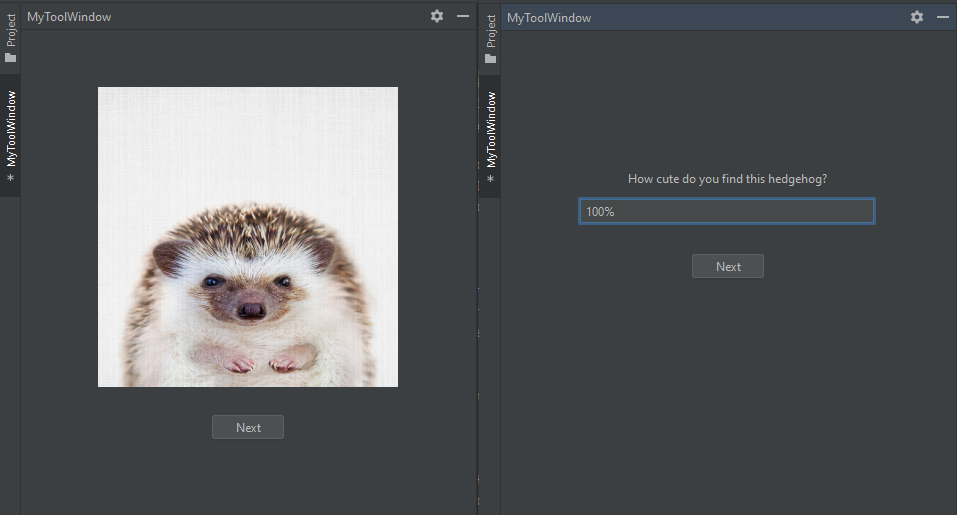

# jet-plugin


[](https://plugins.jetbrains.com/plugin/MARKETPLACE_ID)
[](https://plugins.jetbrains.com/plugin/MARKETPLACE_ID)

<!-- Plugin description -->
This Fancy IntelliJ IDEA plugin demonstrates how to create a custom tool window that gathers user feedback on an image.
<!-- Plugin description end -->



## Features

- Displays an image of a hedgehog
- Asks multiple questions about the image
- Collects user feedback
- Saves feedback to a file in the user's home directory

## Building the Plugin

To build the plugin:

1. Ensure you have JDK 17 or later installed.
2. Clone this repository.
3. Open the project in IntelliJ IDEA.
4. Run IDE for UI Tests or Run the following command in the terminal:
    
    ```shell
    ./gradlew buildPlugin
    ```